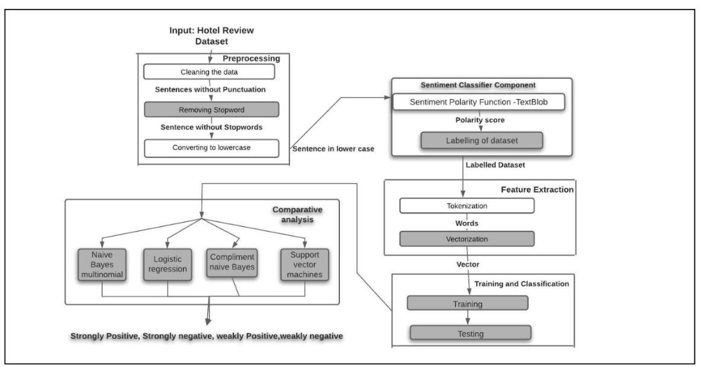

## SENTIMENT ANALYSIS ON HOTEL REVIEWS 
### Overview
A framework for sentiment analysis for the case of hotel customer feedback is designed.
Most available datasets of hotel reviews are not labelled which presents a lot of work for researchers as far as text data pre-processing tasks are concerned.
The proposed framework involves sentiment polarity scores. Based on the polarity score given by the sentiment polarity function, unlabelled dataset is labelled that automatically prepares a sentiment dataset for training and testing to extract unbiased opinions of hotel services from reviews.

### Block Diagram:

### Deliverables:
##### Input:
Text (Hotel review) - Unlabelled dataset
##### Final Output: 
(Strongly positive, weakly positive, strongly negative, weakly negative, neutral review) - Labelled Dataset.
This labelled dataset is later used for classification using different machine learning algortihms.

### Comparative Analysis 
The model has been trained with the transformed unlabelled dataset (Labelled Datatset) and a test was performed to find accuracies of classification for these machine learning algorithms.
(Naive Bayes multinomial, Logistic regression, Complement Naive Bayes,Support vector machine)
